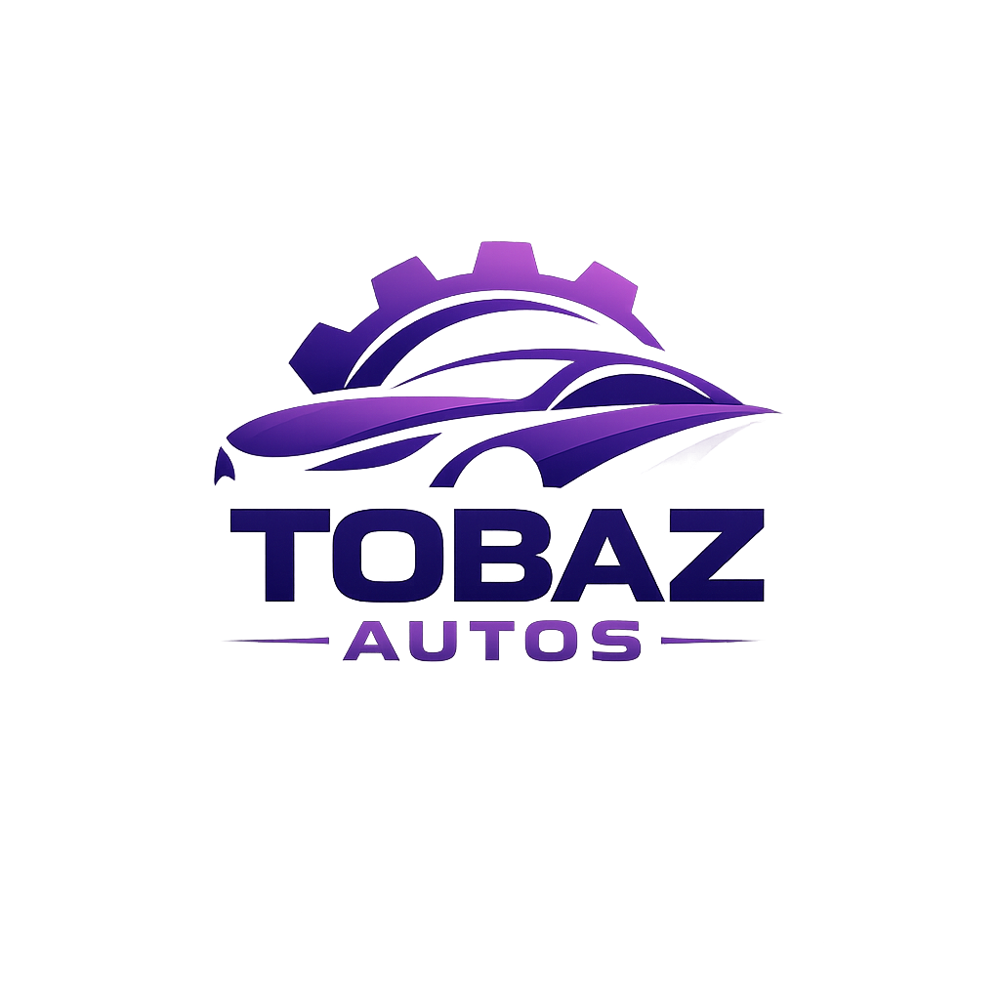

# Tobaz Autos - Django Management System

A complete, production-ready web application for managing an auto parts and vehicle dealership business. Built with Django, featuring a modern responsive UI with dark/light mode support.



## Features

### Products Management

- **Categories**: Small Cars, Auto Parts, Tools, Oil
- **Multiple Images Upload**: Support for multiple product images with primary image selection
- **Multiple Videos Upload**: Support for multiple product videos
- **Product Details**: Name, Category, Price, Quantity, Description, Specifications
- **SEO Fields**: Meta title and description for search engine optimization
- **Stock Status**: Automatic stock tracking (In Stock, Low Stock, Out of Stock)

### Admin Dashboard

- Add, edit, delete products
- Track quantity, sales, and inventory levels
- View product media (images/videos)
- Clean, modern dashboard UI
- Statistics and analytics

### Inventory Management

- Real-time stock tracking
- Product categories management
- Quantity updates when sales happen
- Low stock alerts
- Inventory valuation

### Sales System

- Record sales with multiple products
- Automatic stock reduction
- Track total sales and revenue
- Sales reporting and analytics
- Payment method tracking (Cash, Card, Bank Transfer, Other)
- Order status management (Pending, Processing, Completed, Cancelled)

### Users & Profiles

- User authentication (login/register/logout)
- Profile page with image upload
- User types (Customer, Staff, Admin)
- Contact information management
- Notification preferences

### Settings

- Dark/Light mode toggle
- User preferences storage
- Theme persistence across sessions

### Search & Filter

- Search products by name, SKU, description
- Filter by category and product type
- Sort by price, name, date
- Pagination support

### Responsive Design

- Desktop: Sidebar navigation (left)
- Mobile/Tablet: Bottom navigation bar
- 100% responsive layout
- Smooth animations and hover effects

## Technology Stack

- **Backend**: Django 4.2.7 (Python)
- **Frontend**: HTML5, CSS3, Vanilla JavaScript
- **CSS Framework**: Bootstrap 5.3.2
- **Icons**: Font Awesome 6.4.2
- **Database**: MySQL (with SQLite fallback for development)
- **Static Files**: WhiteNoise
- **Deployment**: Ready for Render

## Project Structure

```
tobaz_autos/
├── tobaz_autos/          # Main Django project
│   ├── settings.py       # Project settings
│   ├── urls.py           # URL configuration
│   ├── wsgi.py           # WSGI application
│   └── asgi.py           # ASGI application
├── core/                 # Core app (home, about, contact)
│   ├── templates/
│   ├── static/
│   ├── views.py
│   ├── urls.py
│   └── context_processors.py
├── products/             # Products app
│   ├── models.py         # Product, Category, ProductImage, ProductVideo
│   ├── views.py
│   ├── urls.py
│   ├── admin.py
│   └── templates/
├── users/                # Users app
│   ├── models.py         # Profile model
│   ├── views.py
│   ├── forms.py
│   ├── urls.py
│   └── templates/
├── sales/                # Sales app
│   ├── models.py         # Sale, SaleItem
│   ├── views.py
│   ├── urls.py
│   ├── admin.py
│   └── templates/
├── dashboard/            # Dashboard app
│   ├── views.py
│   ├── forms.py
│   ├── urls.py
│   └── templates/
├── templates/            # Global templates
│   └── base.html         # Base template with layout
├── static/               # Static files
│   ├── css/
│   ├── js/
│   └── images/
├── media/                # User-uploaded files
│   ├── products/
│   └── profiles/
├── manage.py
├── requirements.txt
└── README.md
```

## Installation

### Prerequisites

- Python 3.8+
- MySQL (optional, SQLite works for development)
- pip

### Step 1: Clone the Repository

```bash
git clone <repository-url>
cd tobaz_autos
```

### Step 2: Create Virtual Environment

```bash
python -m venv venv

# On Windows
venv\Scripts\activate

# On macOS/Linux
source venv/bin/activate
```

### Step 3: Install Dependencies

```bash
pip install -r requirements.txt
```

### Step 4: Database Setup

#### Option A: Using SQLite (Development)

The project is already configured to use SQLite for development. No additional setup needed.

#### Option B: Using MySQL (Production)

1. Create a MySQL database:

```sql
CREATE DATABASE tobaz_autos CHARACTER SET utf8mb4 COLLATE utf8mb4_unicode_ci;
CREATE USER 'tobaz_user'@'localhost' IDENTIFIED BY 'your_password';
GRANT ALL PRIVILEGES ON tobaz_autos.* TO 'tobaz_user'@'localhost';
FLUSH PRIVILEGES;
```

2. Update database settings in `tobaz_autos/settings.py`:

```python
DATABASES = {
    'default': {
        'ENGINE': 'django.db.backends.mysql',
        'NAME': 'tobaz_autos',
        'USER': 'tobaz_user',
        'PASSWORD': 'your_password',
        'HOST': 'localhost',
        'PORT': '3306',
    }
}
```

Or use environment variables:

```bash
export DB_NAME=tobaz_autos
export DB_USER=tobaz_user
export DB_PASSWORD=your_password
export DB_HOST=localhost
export DB_PORT=3306
```

### Step 5: Run Migrations

```bash
python manage.py makemigrations
python manage.py migrate
```

### Step 6: Create Superuser

```bash
python manage.py createsuperuser
```

### Step 7: Collect Static Files

```bash
python manage.py collectstatic
```

### Step 8: Run Development Server

```bash
python manage.py runserver
```

Visit `http://127.0.0.1:8000/` in your browser.

## Deployment on Render

### Step 1: Prepare for Deployment

1. Create a `build.sh` script:

```bash
#!/usr/bin/env bash
set -o errexit

pip install -r requirements.txt

python manage.py collectstatic --no-input
python manage.py migrate
```

2. Make it executable:

```bash
chmod +x build.sh
```

3. Create a `render.yaml` file:

```yaml
services:
  - type: web
    name: tobaz-autos
    runtime: python
    buildCommand: "./build.sh"
    startCommand: "gunicorn tobaz_autos.wsgi:application"
    envVars:
      - key: PYTHON_VERSION
        value: 3.9.0
      - key: DJANGO_SECRET_KEY
        generateValue: true
      - key: DJANGO_DEBUG
        value: "False"
      - key: DJANGO_ALLOWED_HOSTS
        value: ".onrender.com"
      - key: DB_NAME
        value: tobaz_autos
      - key: DB_USER
        value: tobaz_user
      - key: DB_PASSWORD
        value: your_password
      - key: DB_HOST
        value: your_db_host
      - key: DB_PORT
        value: 3306
```

### Step 2: Deploy on Render

1. Push your code to GitHub
2. Create a new Web Service on Render
3. Connect your GitHub repository
4. Use the following settings:
   - **Build Command**: `./build.sh`
   - **Start Command**: `gunicorn tobaz_autos.wsgi:application`
5. Add environment variables as needed
6. Deploy!

## Environment Variables

| Variable               | Description                 | Default                     |
| ---------------------- | --------------------------- | --------------------------- |
| `DJANGO_SECRET_KEY`    | Django secret key           | Generate new for production |
| `DJANGO_DEBUG`         | Debug mode                  | `False` for production      |
| `DJANGO_ALLOWED_HOSTS` | Allowed hosts               | `localhost,127.0.0.1`       |
| `DB_NAME`              | Database name               | `tobaz_autos`               |
| `DB_USER`              | Database user               | `root`                      |
| `DB_PASSWORD`          | Database password           | ``                          |
| `DB_HOST`              | Database host               | `localhost`                 |
| `DB_PORT`              | Database port               | `3306`                      |
| `USE_SQLITE`           | Use SQLite instead of MySQL | `False`                     |

## Usage

### Admin Panel

- Access: `/admin/`
- Login with superuser credentials
- Manage all models from the admin interface

### Dashboard

- Access: `/dashboard/`
- View statistics and recent activity
- Quick actions for common tasks

### Products

- List: `/products/`
- Detail: `/products/<slug>/`
- Search and filter functionality

### Sales

- List: `/sales/`
- Create: `/sales/create/`
- Reports: `/sales/report/`

### User Profile

- Profile: `/users/profile/`
- Settings: `/users/settings/`
- Edit Profile: `/users/profile/edit/`

## Custom Template Tags

The project includes custom template filters for calculations:

```django
{{ value|multiply:2 }}
{{ value|divide:2 }}
```

Add to `products/templatetags/custom_filters.py`:

```python
from django import template

register = template.Library()

@register.filter
def multiply(value, arg):
    return float(value) * float(arg)

@register.filter
def divide(value, arg):
    if float(arg) == 0:
        return 0
    return float(value) / float(arg)
```

## API Endpoints

### Sales

- `GET /sales/api/product-price/<product_id>/` - Get product price (AJAX)

## Security Features

- CSRF protection enabled
- Secure password hashing
- Session security
- XSS protection
- Clickjacking protection (X-Frame-Options)
- Secure cookies in production

## SEO Features

- Meta tags on all pages
- Open Graph tags
- Twitter Card tags
- Semantic HTML
- Structured URLs
- Sitemap ready

## Browser Support

- Chrome 80+
- Firefox 75+
- Safari 13+
- Edge 80+
- Mobile browsers (iOS Safari, Chrome Mobile)

## Contributing

1. Fork the repository
2. Create a feature branch
3. Make your changes
4. Run tests
5. Submit a pull request

## License

This project is licensed under the MIT License.

## Support

For support, email support@tobazautos.com or create an issue in the repository.

## Acknowledgments

- Django Framework
- Bootstrap Team
- Font Awesome
- All contributors

---

**Tobaz Autos** - Your trusted partner in automotive excellence.
